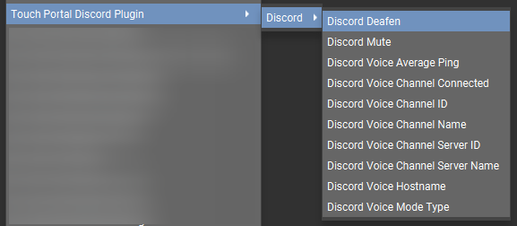

# Touch Portal Plugin to Interact with Discord


- [Touch Portal Plugin to Interact with Discord](#touch-portal-plugin-to-interact-with-discord)
  - [Description](#description)
  - [ChangeLog](#changelog)
  - [Plugin Capabilities](#plugin-capabilities)
    - [Actions](#actions)
    - [States](#states)
  - [Installation and Configuration](#installation-and-configuration)
  - [Known Issues & Solutions](#known-issues--solutions)
  - [Actions](#actions-1)
    - [Discord Mute:](#discord-mute)
    - [Discord Deafen:](#discord-deafen)
    - [Discord Go To Channel](#discord-go-to-channel)
    - [Discord Voice Type](#discord-voice-type)
    - [Discord Voice Hangup](#discord-voice-hangup)
    - [Discord Push To Talk Keys](#discord-push-to-talk-keys)
  - [States](#states-1)
- [Sample Page](#sample-page)
- [Cleanup pre-v4.0.0 config](#cleanup-pre-v400-config)
- [Dependencies](#dependencies)
- [Versioning](#versioning)
- [Authors](#authors)
- [License](#license)
- [Bugs/Enhancements](#bugsenhancements)
- [Acknowledgements](#acknowledgements)

## Description

Mute and Deafen Discord directly from Touch Portal with only Minor configuration needed<br>
Jump to specific Voice or Text channels on servers you joiend to <br>
Hangup voice calls<br>
See Voice Connection Stats (server, ping)<br>
Toggle/Set Push To Talk or Voice Activity Modes <br>
Set Push To Talk Hotkey Combinations<br>

## ChangeLog
```
pre-v4.0.0
  - Mute yourself in Discord
  - Deafen yourself in Discord
  - Worked on fixing connection issues
v4.0.0
  Additions:
    - Action for Voice Mode Changes - PTT to Voice Activity (and back again)
    - Action for Push-To-Talk Hotkey Changing
    - Action to Go to specific Voice or Text channel within a Discord server you belong to
    - If in a Voice Channel allow you to hang up the call
    - Voice Connection Statistics
        Voice Server
        Ping Average
    - State for Voice Channel Connected to
    - State for Voice Mode Type
    - Watch for Discord.exe to be running before attempting to connect, polls every 10 seconds so could cause slight delay in connection if start up is slow (Win Only, still working Mac)
  Updates:
    - Reworked to with Touch Portal v2.3 plugin api enhancement/changes
    - Settings moved from custom built config to inside Touch Portal (will require reconfiguration using discord dev app you already have setup)
      - Will now request authorization EACH time Touch Portal (or the plug-in) starts, this way guaranteeing your Access Token is fresh
        - *Note*: May be reworked in the future to store Access Token but found issues with this implementation during development. 
  Bug Fixes:
    - Added bug fix from pre-v4.0.0 here as well - longer wait times between attempted reconnect
v4.0.1
  - Can't remember.. brain fried
v4.0.2
  Updates:
    - Setting to tell you if Discord was successfully connected to - Valid values are 'Disconnected' or 'Connected'
    - (Windows Only) Setting to disable the Process Watcher if for some reason your system isn't recongizing the application properly.
      - *Note*: This could require a stop/start of TPDiscord if Discord closes while authenticated, this can be done inside Touch Portal Settings -> Plug-Ins -> Select "Touch Portal Discord Plugin" and clicking the Stop button, wait a few seconds, click the Start button
v4.0.3
   Bug Fix:
    - Fixing Voice Activity and PTT switching
v4.0.4
   Bug Fix:
    - Fixes ProcessWatcher for those who experienced issues, it now forces onto the environment path the directories needed for this to work (Windows only)
v4.0.5
   Package Update:
    - Update find-process npm module to 1.4.7 - to pick up bug fix for #32
v4.1.0
   Package Update:
    - Update discord-rpc npm module to 4.0.1 - to pick up bug fix for #41 and ehancement #20
   Updates:
    - No More Re-Auhtorization prompt if you have already authorized your developer app, so restarts will be clean and connect without issue
    - Refactored the event subscription process due to discord-rpc npm module update. Verified all events still fire as expected.
v4.2.0
   Updates:
    - 3 New States - Discord Voice Channel ID, Discord Voice Channel Server, Discord Voice Channel Server ID
v4.2.1
   Updates:
    - pull in latest version  3.1.2 of touchportal-api module (fixes update check failing and killing process)
```

## Plugin Capabilities
### Actions
 - Discord Mute - Mute yourself in Discord
 - Discord Deafen - Deafen yourself in Discord (inherently mutes as well)
 - Discord Hang Up - When in a voice call this will hang up the voice call
 - Discord Select Channel - go to a specific voice/text channel in a given server
 - Discord Reset Push To Talk Keys - resets array inside the plugin, doesn't affect Discord directly
 - Discord Push To Talk Key - adds key to the push to talk key array inside the plugin, doesn't affect Discord Directly
 - Discord Store Push To Talk Keys - store the key combinations in the push to talk key array to Discord to use with Push to Talk

### States
 - Discord Mute 
   - Valid Values: On, Off
 - Discord Deafen
   - Valid Values: On, Off
 - Discord Voice Channel Connected
   - Valid Values: Yes, No
 - Discord Voice Channel Name 
   - Value: Connected voice channel name or 'Personal' &lt;None&gt;
   - Note: This will be 'Personal' when connecting an audio call outside of a server (through DM)
 - Discord Voice Channel ID 
   - Value: Connected voice channel id or &lt;None&gt;
 - Discord Voice Channel Server Name 
   - Value: Connected voice channel server name or 'Personal' or &lt;None&gt;
   - Note: This will be 'Personal' when connecting an audio call outside of a server (through DM)
- Discord Voice Channel Server ID 
   - Value: Connected voice channel server id or 'Personal' or &lt;None&gt;
   - Note: This will be 'Personal' when connecting an audio call outside of a server (through DM)
 - Discord Voice Average Ping
   - Value: in milliseconds)
 - Discord Voice Hostname
   - Value: Voice Host connected to at Discord
 - Discord Voice Mode Type 
   - Valid Values: PUSH_TO_TALK, VOICE_ACTIVITY

## Installation and Configuration
1. Make sure Discord app is open on your PC or Mac
1. Download the .tpp file the installer for your OS [Windows](https://github.com/spdermn02/TouchPortal_Discord_Plugin/tree/master/Installers/TPDiscord-Win.tpp) OR [MacOS](https://github.com/spdermn02/TouchPortal_Discord_Plugin/tree/master/Installers/TPDiscord-Mac.tpp):
1. Go to Touch Portal Settings (the gear icon)
1. Go To Plug-ins
1. Click the Import Plug-in button
1. Navigate to the downloaded tpp file, select it and press Open
1. A popup should tell you Successfully Imported plugin
   1. If this is your first time importing, you will be asked To Trust the Plugin, to prevent this from popping up each time you start Touch Portal, click Trust Always
1. Now Select Touch Portal Discord Plugin in the dropdown on the Plug-ins settings page
1. The Discord Application page should have auto opened on your PC in your browser
   1. if not Visit: <a target="_blank" href="https://discord.com/developers/applications" > Discord Developer Portal </a>
1. Login with your Discord Credentials
1. **If you already have an application from previous plugin usage, skip to Step 20.**
1. Go to "Applications" on the left side of the portal
1. Click "New Application" in the top right of the Applications page
1. Name your Application "Touch Portal Plugin" (or whatever you want to call it), and click "Create"
1. Go to "OAuth2" on the left side of the Site
1. Click the "Add Redirect" button
1. Enter in: `http://localhost` exactly, not trailing slash, and not https://
1. Click "Save Changes"
2. Locate the Client Id and click the "Copy" button, go to the Touch Portal Settings Window and paste in the client id into the "Discord Client Id" field
3. Go back to the developer portal website
4. Locate the Client Secret and click the "Copy" button, go to Touch Portal Settings window and paste in the client secret into the "Discord Client Secret" field
   1. Example: <br> 
5. Click "Save" 
6. After a few seconds, you should get asked to authorize the application you created as a plugin in Discord,  click "Authorize"
   1. Example: I do NOT have the plugin reading all your messages but in order to use this plugin, it needs that scope<br>
    
7. If for some reason, you mis-clicked and the authorize window went away
   1. Click the Stop button on the Touch Portal Discord Plugin settings page
   2. Then Click Start button and it should then re-ask you to authorize
8. Now you should be able to use the new functions of the Touch Portal Discord Plugin!

## Known Issues & Solutions
1. **My Buttons no longer work**
   1. Make sure Discord is open
   2. Go to Touch Portal Settings
   3. Click Plug-ins
   4. Select Touch Portal Discord Plugin in the dropdown
   5. Click Stop button
   6. Click Start Button
   7. Reauthorize the Plugin
1. **The server list blanked out**
   1. delete the action and readd it
   2. if that doesn't work stop and start the plugin as notated above
1. **The channel list blanked out**
   1. Change the server dropdown to a different server, and back again to the server you want

## Actions


### Discord Mute: 
[Sample Mute Button](https://github.com/spdermn02/TouchPortal_Discord_Plugin/tree/master/resources/DiscordMute.tpb)
<br>

### Discord Deafen: 
[Sample Deafen Button](https://github.com/spdermn02/TouchPortal_Discord_Plugin/tree/master/resources/DiscordDeafen.tpb)
<br>

### Discord Go To Channel


### Discord Voice Type


### Discord Voice Hangup


### Discord Push To Talk Keys
*NOTE*: This DOES NOT press them, it sets them as the push to talk keys inside discord
<br>


## States



# Sample Page
[Sample Page Download](https://github.com/spdermn02/TouchPortal_Discord_Plugin/tree/master/resources/TPDiscord-Sample.tpz)
<br>
Has a sample button for all actions, and states to display info

# Cleanup pre-v4.0.0 config
1) After importing v4.0.0 plugin
2) On Windows
   1) Go to %APPDATA%\TouchPortal\plugins
3) On Mac
   1) Go to /Users/&lt;Your User Name&gt;/Documents/TouchPortal/plugins
4) Delete the config folder (this was only used by this plugin)

# Dependencies
 - [discord-rpc](https://www.npmjs.com/package/discord-rpc)
 - [find-process](https://www.npmjs.com/package/find-process)
 - [out-url](https://www.npmjs.com/package/out-url)
 - [touchportal-api](https://www.npmjs.com/package/touchportal-api)

# Versioning

We use [SemVer](http://semver.org/) for versioning. For the versions available, see the [tags on this repository](https://github.com/spdermn02/tpohm_plugin/tags).

# Authors

- **Jameson Allen** - _Initial work_ - [Spdermn02](https://github.com/spdermn02)

# License

This project is licensed under the GPL 3.0 License - see the [LICENSE](LICENSE) file for details

# Bugs/Enhancements
Use the Github Issues tab to report any bugs/enhancements for this plug-in. Or mention them in the Official Touch Portal discord channel #discord

# Acknowledgements
1. Thank you to Reinier and Ty the Touch Portal Creators
2. Thank you to all the users of the Discord Plugin
3. Thank you to [50 Shades of Skittles](https://www.twitch.tv/50_shades_of_skittles) for Testing
4. Thank you to Dominikk#5392 in the Touch Portal Discord for helping troubleshoot for 4.0.4 bug fix
5. Thank you Discord for not shutting down the RPC API
